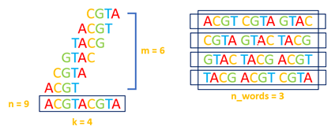
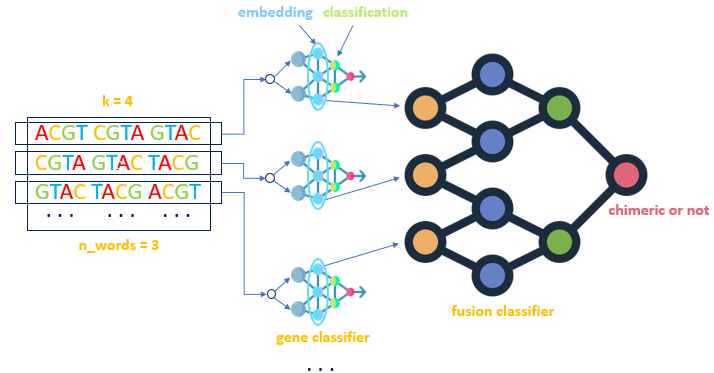

# Table of Contents

* [Introduction](#introduction)
* [Requirements](#requirements)
  * [Download files used](#download-files-used)
* [Gene classifier model](#gene-classifier-model)
* [Gene fusion model](#gene-fusion-model)
* [Results](#results)
* [Citations of works used](#citations-of-works-used)

# Introduction

We propose a novel DL-based model that learns to recognize the
hidden patterns that allow us to identify chimeric RNAs deriving from oncogenic
gene fusions. This consists of a double-classifier framework which first classifies
the sequence of the k-mers of a read, and then infers the chimeric information
by giving as input the list of k-mer classes to a transformer-based classifier.

# Requirements

The requirements for using the project are as follows:
* Unix-like operating system.
* Anaconda environment with version of Python at least 3.8.
* Java version 1.6 or greater.

Below are the commands to install DNABert from the official repository.

```shell
git clone https://github.com/jerryji1993/DNABERT
cd DNABERT
python3 -m pip install --editable .
cd examples
cd ../..
mv DNABERT/src/transformers ./transformers
rm -r DNABERT
```

The following are the commands needed to be able to install the Fusim tool.

```shell
wget https://github.com/aebruno/fusim/raw/master/releases/fusim-0.2.2-bin.zip
unzip fusim-0.2.2-bin.zip
rm fusim-0.2.2-bin.zip

wget -O refFlat.txt.gz http://hgdownload.cse.ucsc.edu/goldenPath/hg19/database/refFlat.txt
gunzip refFlat.txt.gz
mv refFlat.txt fusim-0.2.2/refFlat.txt

wget ftp://hgdownload.cse.ucsc.edu/goldenPath/hg19/bigZips/chromFa.tar.gz
tar -xzf chromFa.tar.gz
cat chr*.fa > fusim-0.2.2/hg19.fa
rm chromFa.tar.gz
rm chr*.fa

sudo apt install samtools
samtools faidx fusim-0.2.2/hg19.fa
```

Next, you need to install pytorch with CUDA support. 
The version of Cuda used for the development of this project is **cu118**.

```shell
CUDA_VERSION=cu118
pip3 install torch torchvision torchaudio \
  --index-url https://download.pytorch.org/whl/${CUDA_VERSION}
```

Finally, it is necessary to install the following libraries.

```shell
pip install tabulate
pip install checksumdir
pip install python-dotenv
conda install -c conda-forge biopython
conda install -c conda-forge matplotlib

apt install genometools
apt install art-nextgen-simulation-tools
```

## Download files used
Following are the instructions needed to download the genomic data used to train and evaluate the models.

# Gene classifier model
The first model that is defined within this project is the **gene classifier** model. 
The goal of this model is to correctly classify sentences in the source gene. 
More formally, we define a sentence as a string consisting of *n* words each 
separated by space, where each word is a *kmer*.

Starting with a read, we generate all possible kmers, of length ```len_kmer```, of the read. 
Let ```n_words``` be the number of kmers that make up a sentence, then all possible subsets of consecutive 
kmers of cardinality ```n_words``` are generated. This allows all possible sentences to be generated from a 
read. The goal of the classifier is to correctly classify a sentence to the source gene of the read used 
to generate the sentence.

The following are the input parameters of the ```train_gene_classifier.py``` script, which is the script responsible 
for training and evaluating the gene classification model.

## Parameters
* ```len_read```: define length of reads.
* ```len_overlap```: define length of overlapping between reads.
* ```len_kmer```: define length of kmers.
* ```n_words```: number of kmers inside a sentence
* ```tokenizer_selected```: select the tokenizer to be used. The possible values are:
  * *dna_bert*: vocabulary encoding all possible kmer on the alphabet {A, C, G, T}.
  * *dna_bert_n*: vocabulary encoding all possible kmer on the alphabet {A, C, G, T, N}.
* ```batch_size```: define batch size.
* ```model_selected```: defines the model to be tested. Possible inputs are:
  * *dna_bert*: uses the dna bert model to make the classification.
* ```hidden_size```: define number of hidden channels.
* ```n_hidden_layers```: define number of hidden layers.
* ```rnn```: define type of recurrent layer. The possible value are:
  * *lstm*: selects as recurrent layers of type Long short-term memory.
  * *gru*: selects Gated recurrent unit as a recurrent layer.
* ```n_rnn_layers```: define number of recurrent layers.
* ```n_attention_heads```: define number of attention heads.
* ```n_beams```: define number of beams.
* ```dropout```: define value of dropout probability.
* ```grid_search```: if the value is set to true then if the model has already been tested with the 
hyperparameters given as input then the program terminates, otherwise the model is evaluated again on the test set.

Below is the command to train the gene classification model with the best configuration found.
```shell
python3 train_gene_classifier.py -len_read 150 \
                                 -len_overlap 0 \
                                 -len_kmer 6 \
                                 -n_words 30 \
                                 -batch 512 \
                                 -tokenizer_selected dna_bert_n \
                                 -model_selected dna_bert \
                                 -hidden_size 768 \
                                 -n_hidden_layers 7 \
                                 -rnn lstm \
                                 -n_rnn_layers 3 \
                                 -n_attention_heads 1 \
                                 -n_beams 1 \
                                 -dropout 0.5
```

# Gene fusion model

## From k-mers to sentences
The k-mers, i.e., all the substrings of length k which can be extracted from a DNA or RNA sequence, allow the local characteristics of
the sequences to be considered while lessening the impact of sequencing errors. In this work we represent a read using the list of its k-mers. This representation
allows the model to learn the local characteristics of reads and perform accurate classification. The solution proposed is based on the definition of a model capable of analyzing and classifying lists of k-mers. More precisely, given a read of length n and a value k, we extract the list of its n − k + 1 k-mers. We split such list in consecutive segments of n_words k-mers. Then, the k-mers in a segment are joined together in a sentence by using a space character as a separator, thus producing a set of sentences. The following figure shows an example of sentences generated from an input read, using k = 4 and n_words = 3 (that is, 3 k-mers per sentence).



## The DL-based model. 
The sentence-based representation previously described above is in turn exploited by a DL-based model for the detection of chimeric reads,
built as an ensemble of two sub-models: Gene classifier and Fusion classifier. The goal of Gene classifier is to classify a sentence into the gene from which it is
generated. It is trained using all the sentences derived from non-chimeric reads extracted from the transcripts of a reference set of genes (see the following figure).



To train Fusion classifier, a set of chimeric and non-chimeric reads is generated from the same reference set of genes used for training Gene classifier. Then, for
each read all the sentences of length n_words are generated and then provided as input to Gene classifier, previously trained. Gene classifier includes an embedding
layer, as well as several classification layers. The outputs of the embedding layer for all the generated sentences are grouped into a single embedding matrix, which
constitutes the input for Fusion classifier. Then, Fusion classifier uses such embedding matrices to distinguish between reads that arise from the fusion of
two genes and reads that originate from a single gene.

# Results

## Gene classifier

### Data analysis

# Supplementary materials

# Citations of works used
This section provides citations of all the work used in the development of this project.
* **DNABert**: [Yanrong Ji and others, DNABERT: pre-trained Bidirectional Encoder Representations 
from Transformers model for DNA-language in genome, Bioinformatics, Volume 37, Issue 15, 1 August 2021, 
Pages 2112–2120](https://doi.org/10.1093/bioinformatics/btab083).
* **Fusim**: [Bruno, A.E., Miecznikowski, J.C., Qin, M. et al. FUSIM: a software tool for simulating 
fusion transcripts. BMC Bioinformatics 14, 13 (2013)](https://doi.org/10.1186/1471-2105-14-13).
